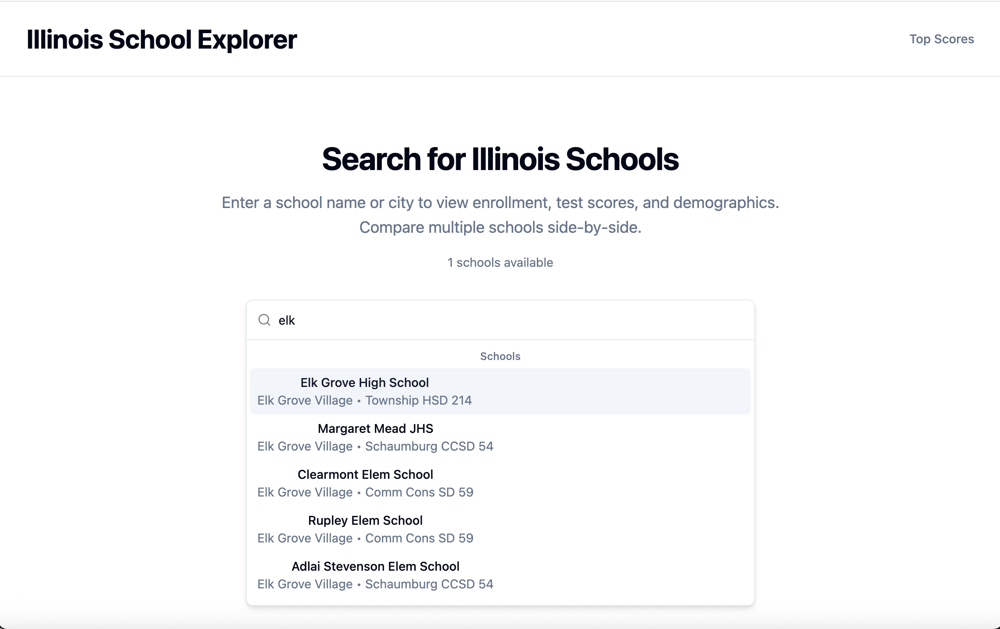
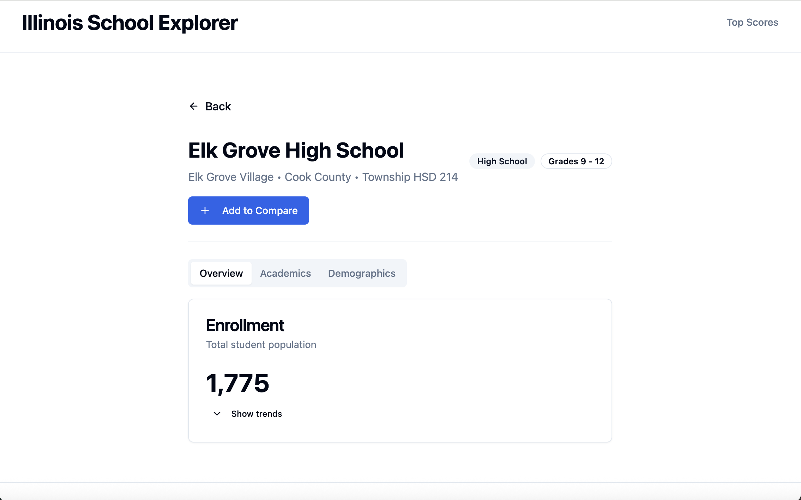
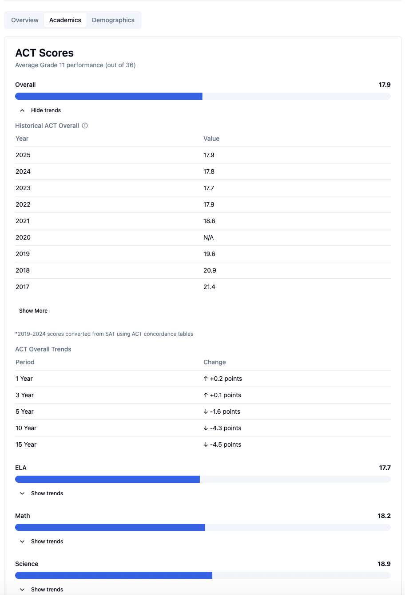
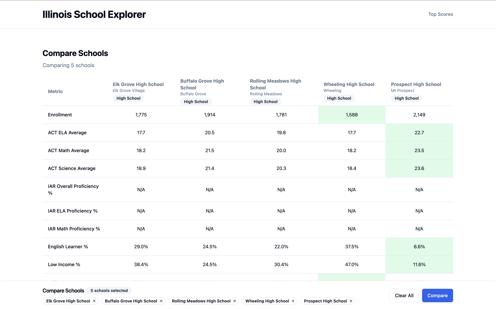

# Illinois School Explorer

A full-stack web application for exploring and comparing Illinois K-12 schools using official 2025 Report Card data from the Illinois State Board of Education.

**Live Application:** https://illinois-school-explorer.vercel.app


*Screenshot: Main search interface with full-text search across 3,827 Illinois schools*

---

## Overview

Finding and comparing Illinois schools shouldn't require navigating spreadsheets with 681 columns. This application transforms the Illinois State Board of Education's 2025 Report Card dataset into an interactive, searchable web experience.

**What it does:**
- **Search** 3,827 Illinois schools by name, city, or district
- **Explore** detailed metrics: enrollment, test scores (ACT/IAR), demographics, diversity
- **Compare** schools side-by-side with persistent comparison basket
- **Analyze** historical trends (1, 3, 5, 10, and 15-year windows) for enrollment, demographics, and test scores
- **Discover** top-performing schools through ranked leaderboards

**Why I built this:**

As someone interested in education data and full-stack development, I wanted to create a practical tool that makes public education data more accessible while demonstrating modern web application architecture. The project showcases end-to-end full-stack development: data processing and normalization, REST API design, responsive UI development, and production deployment.

---

## Live Demo

**Frontend:** https://illinois-school-explorer.vercel.app
**Backend API:** https://illinois-school-explorer-production.up.railway.app
**API Documentation:** https://illinois-school-explorer-production.up.railway.app/docs (Interactive Swagger UI)

---

## Features & Screenshots

### 1. School Search & Discovery

Full-text search powered by SQLite FTS5, ranking results by relevance across school names, cities, and districts.


*Screenshot: Search results with highlighted matches and school metadata*

**Technical highlights:**
- FTS5 (Full-Text Search) with rank-based sorting
- Debounced search input for performance
- Keyboard navigation support
- TanStack Query for intelligent caching

---

### 2. Detailed School Profiles

Comprehensive school information with current metrics and historical trends spanning up to 15 years.


*Screenshot: School detail page showing enrollment, ACT scores, demographics, and diversity metrics*

**Metrics displayed:**
- **Enrollment:** Current enrollment with 1/3/5/10/15-year trend analysis
- **Test Scores:** ACT composite scores (high schools) and IAR proficiency rates (elementary/middle schools)
- **Demographics:** English Learner percentage, Low Income percentage
- **Diversity:** 8-category racial/ethnic breakdown with trend data
- **Historical Data:** Year-by-year values from 2010-2025


*Screenshot: Expandable historical trend tables with 15 years of data*

**Technical highlights:**
- Expandable/collapsible trend sections for better UX
- Null-safe rendering for suppressed data (privacy protection)
- Computed metrics (e.g., IAR overall proficiency from ELA + Math)
- Responsive tables with proper semantic HTML

---

### 3. Side-by-Side School Comparison

Compare 2-5 schools simultaneously with persistent comparison basket across page navigation.


*Screenshot: Multi-school comparison table with side-by-side metrics*

**Technical highlights:**
- React Context for global comparison state
- LocalStorage persistence
- Multi-select UI with add/remove controls
- Handles missing data gracefully (schools without certain metrics)

---

### 4. Top Scores Leaderboard

Ranked lists of top-performing schools by ACT composite (high schools) or IAR proficiency (elementary/middle schools).


*Screenshot: Top 100 schools ranked by assessment type and filtered by school level*

**Technical highlights:**
- Filter by school level (elementary, middle, high)
- Filter by assessment type (ACT, IAR)
- Proper tie-breaking for equal scores
- Efficient database queries with proper indexing

---

## Tech Stack

### Backend
- **FastAPI** - Modern Python web framework with automatic OpenAPI documentation
- **SQLite with FTS5** - Lightweight database with full-text search capabilities
- **SQLAlchemy 2.0** - ORM with modern async-ready query patterns
- **Pydantic** - Request/response validation and serialization
- **pytest** - Comprehensive test suite with 79 tests and >80% coverage

### Frontend
- **React 18 + TypeScript** - Type-safe component-based UI
- **Vite** - Lightning-fast build tool and dev server
- **TanStack Query v5** - Powerful server state management with caching
- **shadcn/ui + Tailwind CSS** - Accessible component library with utility-first styling
- **React Router v7** - Client-side routing with data loading
- **Vitest + Playwright** - Unit testing and end-to-end test automation

### Deployment & DevOps
- **Railway** - Backend hosting with automatic deploys from GitHub
- **Vercel** - Frontend hosting with edge network distribution
- **GitHub Actions** - Continuous integration (future enhancement)

---

## Architecture

### System Design

```
┌─────────────────┐         HTTP/JSON          ┌──────────────────┐
│   React Client  │ ◄────────────────────────► │  FastAPI Backend │
│   (Vercel)      │                             │   (Railway)      │
└─────────────────┘                             └──────────────────┘
        │                                                │
        │ TanStack Query                                │ SQLAlchemy ORM
        │ (caching, state)                              │
        │                                                ▼
        │                                        ┌──────────────────┐
        │                                        │  SQLite Database │
        │                                        │   + FTS5 Index   │
        │                                        │   (3,827 schools)│
        │                                        └──────────────────┘
        │
        ▼
   localStorage
   (comparison basket)
```

### Backend Architecture

**REST API Design:**
- 4 primary endpoints with clear, RESTful resource naming
- Pydantic models ensure type safety from database to JSON response
- CORS configured for both development and production origins
- Automatic OpenAPI (Swagger) documentation generation

**Database Schema:**
- Denormalized design for read performance (294+ columns)
- FTS5 virtual table for fast full-text search
- 54 trend columns (12 metrics × 1/3/5/10/15-year windows)
- 240 historical columns (16 years × 15 metrics)

**Data Processing Pipeline:**
1. Parse 39MB Excel file with 681 columns
2. Merge multiple sheets (General Info, ACT Scores, IAR Scores)
3. Clean and normalize data (handle suppressed values, percentages)
4. Calculate trends from historical Report Card data (2010-2025)
5. Bulk insert with SQLAlchemy for efficiency

### Frontend Architecture

**Component Patterns:**
- Presentational/Container separation
- Custom hooks for API integration (`useSchoolDetail`, `useSearch`)
- Compound components for complex UI (TrendDisplay + TrendTable + HistoricalDataTable)
- Type-safe props with TypeScript interfaces

**State Management:**
- TanStack Query for server state (automatic caching, background refetching)
- React Context for global client state (comparison basket)
- URL search params for shareable filter state
- LocalStorage for persistence across sessions

**Performance Optimizations:**
- Query result caching (5-minute stale time)
- Debounced search input
- Lazy loading for heavy components
- Optimized bundle splitting with Vite

---

## Data Pipeline

### Source Data

**Primary Dataset:**
- **File:** `2025-Report-Card-Public-Data-Set.xlsx` (39MB)
- **Source:** Illinois State Board of Education
- **Records:** 3,827 schools (filtered from 5,000+ entities to `Level == 'School'`)
- **Metrics:** 681 columns covering enrollment, assessments, demographics, diversity, programs

**Historical Data:**
- Excel files (2010-2024): Enrollment, demographics, diversity breakdowns
- TXT files (2010-2017): ACT/SAT scores with format conversions
- SAT-to-ACT concordance table for score normalization

### Import Process

```bash
cd backend
uv run python -m app.utils.import_data ../2025-Report-Card-Public-Data-Set.xlsx
```

**Processing steps:**
1. Load and merge multiple Excel sheets (General, ACT, IAR)
2. Filter to school-level entities (exclude districts, state aggregates)
3. Clean data (convert percentages, handle asterisks/nulls)
4. Normalize school types to standard levels (elementary, middle, high, other)
5. Calculate historical trends from 16 years of data
6. Bulk insert 3,827 records with 294+ fields each

**Output:** SQLite database (7MB) optimized for read-heavy operations

---

## Key Technical Challenges & Solutions

### Challenge 1: Historical Trend Calculation

**Problem:** Calculate 1/3/5/10/15-year trends for 12 different metrics across 3,827 schools from heterogeneous historical data sources (Excel, TXT, varying formats).

**Solution:**
- Built `HistoricalDataLoader` class to abstract over different file formats
- Implemented year-specific parsers for Excel (2019-2025) and TXT (2010-2018) files
- Created `TrendCalculator` to compute deltas between current and historical values
- Handled edge cases: missing years, suppressed data, school consolidations

**Result:** 54 pre-calculated trend columns populated during import, enabling instant trend queries without runtime computation.

### Challenge 2: Full-Text Search Performance

**Problem:** Enable sub-100ms search across school names, cities, and districts with relevance ranking.

**Solution:**
- Used SQLite FTS5 (Full-Text Search 5) virtual table
- BM25 ranking algorithm for relevance scoring
- Compound search across multiple fields with proper tokenization
- Debounced input on frontend (300ms) to reduce API calls

**Result:** Fast, Google-like search experience with highlighted matches and ranked results.

### Challenge 3: Type Safety Across Stack

**Problem:** Ensure data integrity from database → API → frontend without duplication or drift.

**Solution:**
- Single source of truth: Pydantic models in backend
- Generated TypeScript types matching Pydantic schemas
- TanStack Query hooks typed to API responses
- Compile-time checks prevent mismatched field access

**Result:** No runtime type errors, auto-complete in IDE, refactor-safe codebase.

---

## Project Structure

```
illinois-school-explorer/
├── backend/                       # FastAPI REST API
│   ├── app/
│   │   ├── api/                   # Route handlers (schools, search, compare, top-scores)
│   │   │   ├── schools.py         # School detail & comparison endpoints
│   │   │   ├── search.py          # Full-text search endpoint
│   │   │   └── top_scores.py      # Leaderboard endpoint
│   │   ├── services/              # Business logic layer
│   │   │   └── top_scores.py      # Ranking and filtering logic
│   │   ├── utils/                 # Data processing utilities
│   │   │   ├── import_data.py     # Excel → SQLite import pipeline
│   │   │   ├── import_historical_trends.py  # Trend calculation engine
│   │   │   └── historical_loader.py         # Multi-format historical data loader
│   │   ├── database.py            # SQLAlchemy ORM models (School, FTS5)
│   │   ├── models.py              # Pydantic response schemas
│   │   └── main.py                # FastAPI application setup
│   ├── docs/
│   │   ├── API_ENDPOINTS.md       # Complete API reference with examples
│   │   └── DATABASE_SCHEMA.md     # Detailed schema documentation
│   ├── tests/                     # 13 test files (79 tests, >80% coverage)
│   │   ├── test_schools_api.py    # API endpoint tests
│   │   ├── test_import_data.py    # Data import tests
│   │   └── ...
│   └── README.md                  # Backend setup & development guide
│
├── frontend/                      # React + TypeScript UI
│   ├── src/
│   │   ├── components/            # Reusable React components
│   │   │   ├── SchoolDetailView.tsx     # School profile display
│   │   │   ├── TrendTable.tsx           # Trend data visualization
│   │   │   ├── TrendDisplay.tsx         # Expandable trend container
│   │   │   ├── HistoricalDataTable.tsx  # Year-by-year data table
│   │   │   ├── SchoolComparisonCard.tsx # Individual comparison card
│   │   │   └── ui/                      # shadcn/ui components
│   │   ├── routes/                # Page components
│   │   │   ├── Home.tsx           # Landing page with search
│   │   │   ├── SchoolDetail.tsx   # School profile page
│   │   │   ├── Compare.tsx        # Side-by-side comparison
│   │   │   └── TopScores.tsx      # Leaderboard page
│   │   ├── lib/
│   │   │   ├── api/               # API integration layer
│   │   │   │   ├── client.ts      # Axios instance with base config
│   │   │   │   ├── types.ts       # TypeScript types matching backend
│   │   │   │   └── queries.ts     # TanStack Query hooks
│   │   │   └── trendUtils.ts      # Trend formatting utilities
│   │   └── App.tsx                # Root component with routing
│   ├── tests/
│   │   ├── e2e/                   # Playwright end-to-end tests
│   │   └── [component].test.tsx  # 23 Vitest unit test files
│   └── README.md                  # Frontend setup & component docs
│
├── data/
│   ├── 2025-Report-Card-Public-Data-Set.xlsx     # Primary dataset
│   └── historical-report-cards/   # Historical data (2010-2024)
│       ├── rc10/                  # 2010 data (TXT format)
│       ├── rc11/                  # 2011 data (TXT format)
│       └── ...                    # 2012-2024 (Excel format)
│
├── docs/
│   ├── screenshots/               # App screenshots (placeholder)
│   └── trend-data-workflow.md     # Historical data processing guide
│
├── PROJECT_OVERVIEW.md            # High-level app overview for AI context
├── CLAUDE.md                      # Development guidelines and conventions
└── README.md                      # This file
```

---

## Quick Start

### Prerequisites
- **Python 3.11+** with `uv` package manager
- **Node.js 18+** with `npm`
- **Git** for version control

### Backend Setup

```bash
# 1. Navigate to backend directory
cd backend

# 2. Install dependencies with uv
uv sync --all-extras

# 3. Import the Illinois schools dataset (creates SQLite database)
uv run python -m app.utils.import_data ../2025-Report-Card-Public-Data-Set.xlsx

# 4. Start the FastAPI development server
uv run uvicorn app.main:app --reload --port 8000
```

**Backend running at:** http://localhost:8000
**API Documentation:** http://localhost:8000/docs

### Frontend Setup

```bash
# 1. Navigate to frontend directory (from project root)
cd frontend

# 2. Install dependencies
npm install

# 3. Copy environment template
cp .env.example .env.local

# 4. Start the Vite development server
npm run dev
```

**Frontend running at:** http://localhost:5173

---

## Testing

### Backend Tests (pytest)

```bash
cd backend

# Run all tests (including slow integration tests)
uv run pytest

# Run only fast unit tests
uv run pytest -m "not slow"

# Run with coverage report
uv run pytest --cov=app --cov-report=term-missing

# Run specific test file
uv run pytest tests/test_schools_api.py -v
```

**Test Coverage:**
- 13 test files, 79 total tests
- >80% overall coverage
- >95% coverage on API modules

### Frontend Tests (Vitest + Playwright)

```bash
cd frontend

# Run unit tests
npm run test:run

# Run unit tests in watch mode
npm run test

# Run end-to-end tests
npm run test:e2e

# Run E2E tests in UI mode
npm run test:e2e:ui
```

**Test Coverage:**
- 23 unit test files (140 tests)
- 6 E2E test files covering critical user flows
- Tests for components, API integration, routing, and full user journeys

---

## API Endpoints

**Development:** http://localhost:8000
**Production:** https://illinois-school-explorer-production.up.railway.app
**Interactive Docs:** http://localhost:8000/docs (Swagger UI)

### Endpoints Overview

| Endpoint | Method | Description |
|----------|--------|-------------|
| `/api/search` | GET | Full-text search across school names, cities, and districts |
| `/api/schools/{rcdts}` | GET | Retrieve complete school details by RCDTS identifier |
| `/api/schools/compare` | GET | Compare 2-5 schools side-by-side |
| `/api/top-scores` | GET | Ranked leaderboard by ACT or IAR scores |
| `/health` | GET | Health check endpoint |

### Example API Calls

**Search for schools:**
```bash
curl "http://localhost:8000/api/search?q=Elk+Grove&limit=10"
```

**Get school details:**
```bash
curl "http://localhost:8000/api/schools/05-016-2140-17-0002"
```

**Compare multiple schools:**
```bash
curl "http://localhost:8000/api/schools/compare?rcdts=05-016-2140-17-0002,05-016-2220-17-0001"
```

**Top 50 high schools by ACT:**
```bash
curl "http://localhost:8000/api/top-scores?assessment=act&level=high&limit=50"
```

See [backend/docs/API_ENDPOINTS.md](backend/docs/API_ENDPOINTS.md) for complete API documentation with request/response examples.

---

## Production Deployment

### Frontend (Vercel)

**URL:** https://illinois-school-explorer.vercel.app

**Configuration:**
- **Platform:** Vercel
- **Framework:** Vite (auto-detected)
- **Root Directory:** `frontend`
- **Build Command:** `npm run build`
- **Output Directory:** `dist`
- **Auto-deploy:** Enabled from `main` branch

**Environment Variables:**
```
VITE_API_URL=https://illinois-school-explorer-production.up.railway.app
```

### Backend (Railway)

**URL:** https://illinois-school-explorer-production.up.railway.app

**Configuration:**
- **Platform:** Railway
- **Framework:** Python (Nixpacks auto-detect)
- **Root Directory:** `backend`
- **Start Command:** `uvicorn app.main:app --host 0.0.0.0 --port $PORT`
- **Auto-deploy:** Enabled from `main` branch

**Environment Variables:**
```
ALLOWED_ORIGINS=http://localhost:5173,http://127.0.0.1:5173,https://illinois-school-explorer.vercel.app
```

**Database:**
- SQLite file (7MB) deployed alongside application
- Persists across deployments using Railway volumes
- No external database service required

### Deployment Workflow

1. **Develop locally** with hot-reload dev servers
2. **Run tests** to ensure changes don't break functionality
3. **Commit and push** to `main` branch on GitHub
4. **Automatic deployment:**
   - Railway rebuilds backend (2-3 minutes)
   - Vercel rebuilds frontend (1-2 minutes)
5. **Verify** at production URLs

---

## Development Workflow

### Test-Driven Development (TDD)

This project follows TDD principles:

1. **Red:** Write a failing test that defines desired functionality
2. **Green:** Write minimal code to make the test pass
3. **Refactor:** Improve code quality while keeping tests passing

### Git Workflow

**Conventional Commits:**
- `feat:` New feature
- `fix:` Bug fix
- `docs:` Documentation changes
- `test:` Test additions or modifications
- `refactor:` Code refactoring without behavior changes
- `style:` Formatting, whitespace changes
- `chore:` Build scripts, dependencies

**Example:**
```bash
git commit -m "feat: add 10yr and 15yr trend metrics to school detail page"
```

### Code Quality Standards

- **Type Safety:** TypeScript on frontend, Pydantic on backend
- **Testing:** Minimum 80% coverage on new code
- **Documentation:** Every file starts with ABOUTME comment explaining its purpose
- **Formatting:** Consistent style across codebase (Prettier for frontend, Black for backend)

See [CLAUDE.md](CLAUDE.md) for complete development guidelines.

---

## Key Concepts

### RCDTS Identifiers

Every Illinois school has a unique **RCDTS code** (Regional County District Type School):
- **Format:** `05-016-2140-17-0002` (hyphen-separated)
- **Usage:** Primary identifier for school lookups, comparisons, and detail pages
- **Stability:** Codes remain constant across years

### School Levels

Schools are categorized into normalized levels for filtering and leaderboards:
- `elementary` - Elementary and primary schools
- `middle` - Middle and junior high schools
- `high` - High schools
- `other` - Alternative and special education schools

Computed during data import from the original `school_type` field.

### Suppressed Data

Illinois suppresses certain metrics when student counts are too low (< 10 students) for privacy protection:
- **In source data:** Asterisks (`*`) in Excel files
- **In database:** `NULL` values
- **In API responses:** `null` in JSON
- **In frontend:** Displayed as "N/A"

Common scenarios:
- ACT scores for elementary schools (no ACT testing)
- Small demographic categories
- New schools without historical data

### Historical Trends

Multi-year percentage changes calculated from historical Report Card data:
- **1-year trend:** 2024 → 2025
- **3-year trend:** 2022 → 2025
- **5-year trend:** 2020 → 2025
- **10-year trend:** 2015 → 2025
- **15-year trend:** 2010 → 2025

Trends are pre-calculated during data import and stored as database columns for instant querying.

See [PROJECT_OVERVIEW.md](PROJECT_OVERVIEW.md) for detailed concept explanations.

---

## Future Enhancements

### Data Expansions
- [ ] Graduation rates and college enrollment statistics
- [ ] Teacher-to-student ratios and teacher qualifications
- [ ] Disciplinary data (suspensions, expulsions)
- [ ] School ratings and ESSA designations
- [ ] Special education program details

### Feature Additions
- [ ] Advanced filtering (by enrollment range, test score range, demographics)
- [ ] Geographic search with map view (Mapbox/Google Maps)
- [ ] Export comparisons to PDF or CSV
- [ ] User accounts for saving favorite schools and comparisons
- [ ] Email alerts for data updates

### Technical Improvements
- [ ] PostgreSQL migration for better scalability
- [ ] GraphQL API alongside REST
- [ ] Redis caching layer
- [ ] API authentication and rate limiting
- [ ] Performance monitoring (Sentry, DataDog)
- [ ] CI/CD pipeline with GitHub Actions

---

## Documentation

- **[Project Overview](PROJECT_OVERVIEW.md)** - High-level context for developers and AI assistants
- **[Backend README](backend/README.md)** - Complete backend setup and API documentation
- **[Frontend README](frontend/README.md)** - Frontend architecture and component guide
- **[Database Schema](backend/docs/DATABASE_SCHEMA.md)** - Detailed database structure
- **[API Endpoints](backend/docs/API_ENDPOINTS.md)** - API reference with examples
- **[Development Guidelines](CLAUDE.md)** - Coding standards and best practices

---

## License

MIT License - feel free to use this project as a reference or starting point for your own work.

---

## Contact

**Kyle Pfister**

- **GitHub:** [@kpfister44](https://github.com/kpfister44)
- **LinkedIn:** [Add your LinkedIn]
- **Email:** [Add your email]
- **Portfolio:** [Add your portfolio URL]

**Have questions or suggestions?** Open an issue on GitHub or reach out directly!

---

**Built using FastAPI, React, and public education data from the Illinois State Board of Education.**
